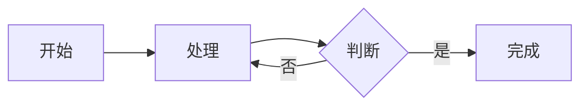

# md2html 用户指南

md2html 是一个命令行工具，把 Markdown 文件或整个 Markdown 文档目录，转成带目录导航的**单页 HTML 文档**。mermaid 图表开箱即用，无需额外配置。

## 特性

- **单文件或目录输入**：一篇 md 或整个项目文档集，一键构建
- **自动目录结构**：子目录自动成为章节，文件名排序决定顺序，`index.md`/`README.md` 自动作为章节首页
- **mermaid 两种渲染模式**：默认浏览器端实时渲染（零依赖），可选构建期预渲染为 PNG（需 mmdc）
- **离线单文件**：浏览器模式产物不依赖任何 CDN 或外部资源，拷走即看
- **标准 Sphinx 项目**：输出目录是完整可编辑的 Sphinx 项目，修改后可 `make singlehtml` 重新构建

## 安装

要求 **Python >= 3.9**。建议在虚拟环境中安装：

```bash
python3 -m venv venv
source venv/bin/activate
pip install /path/to/md2html
```

安装后即可使用 `md2html` 命令。

### 可选依赖

仅在 `--mermaid-mode png` 模式下需要，默认 browser 模式不需要：

```bash
npm install -g @mermaid-js/mermaid-cli
```

## 快速开始

### 单个 Markdown 文件

```bash
md2html 文档.md -o ./output
```

输出目录 `./output` 中：
- `source/` —— 生成的 Sphinx 源文件
- `build/singlehtml/index.html` —— 最终的单页 HTML 文档
- `Makefile` / `make.bat` —— 标准 Sphinx 构建脚本，可修改 source/ 后重新 `make singlehtml`

### 整个文档目录

```bash
md2html ./mydocs -o ./output
```

输入目录中的所有 `.md` 文件会被组织成带章节导航的文档集。

### mermaid 示例

文档中的 mermaid 代码块会被自动渲染为图表：

